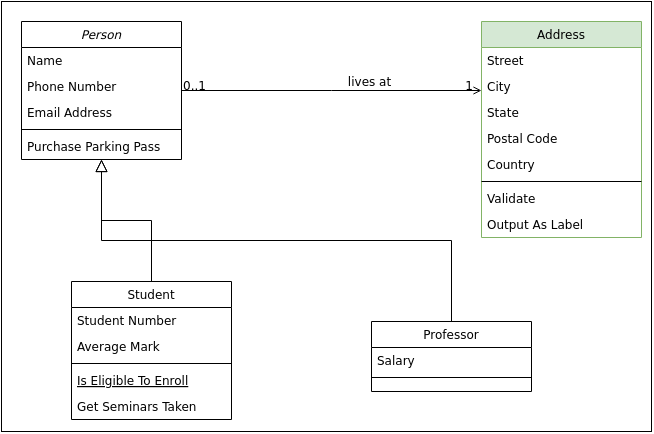

# experiment
just some random experiments with ghithub, github action and packages

## Automatically generated draw.io images

## As simple SVG

https://app.diagrams.net/#Hnkoester%2Fgithub-experiments%2Fmain%2Fdoc%2Fgeneration_test_2.drawio.svg

OR via

### clickable to edit directly

https://app.diagrams.net/#Hnkoester%2Fgithub-experiments%2Fmain%2Fdoc%2Fgeneration_test_2.drawio.svg
